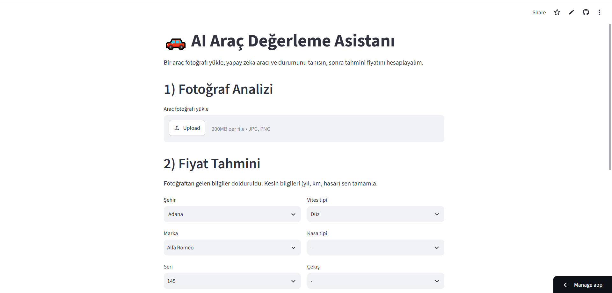

# 🚗 AI Vehicle Valuation Assistant

A multimodal AI web app that analyzes a car photo, identifies the vehicle and its visible condition, and then estimates its market price using a machine learning model trained on real Turkish used-car data.

Upload a photo → the AI recognizes the make, model, color and visible damage → the details auto-fill a price form → a trained ML model predicts the value, including the effect of damage.

## 🚀 Live Demo

👉 [Try the app here](https://guanrynhgariacpngg9q6d.streamlit.app)

## 📸 Screenshot



## 🛠️ Tech Stack

- **Python** – core language
- **Google Gemini (Vision)** – multimodal image understanding (make/model/condition detection)
- **scikit-learn** – price prediction model (Random Forest + Pipeline & OneHotEncoder)
- **pandas** – data processing and cleaning
- **Streamlit** – web interface, deployment and secrets management

## ✨ Features

- **Photo analysis:** the AI identifies make, model, color, body type and visible condition.
- **Honest condition assessment:** reports only what is visible and notes it is a preliminary impression, not a real inspection.
- **Automatic form filling:** detected make, series and estimated year are pre-filled into the price form.
- **Damage-aware pricing:** optional inspection fields are shown only when relevant; the model learns their price impact from real data.
- **Robust API handling:** automatic retry and multi-model fallback to handle rate limits (429) and high-demand (503) errors.

## 📊 About the Project

The price model is trained on real used-car market data from Türkiye (~53,500 listings, April 2026). It uses features such as city, make, series, model, fuel type, transmission, body type, drivetrain, year, mileage, engine size, horsepower — and inspection data (damage record, replaced and painted parts) to reflect how damage lowers value.

Categorical text features are encoded with a scikit-learn Pipeline and OneHotEncoder (with min_frequency for high-cardinality fields). The model is trained in memory on startup and cached. Image analysis is powered by Google Gemini's vision capabilities, with the API key stored securely in Streamlit secrets (never committed to the repo).

## ⚠️ Note

The AI's condition assessment is a visual preliminary impression based only on the photo and does not replace a professional vehicle inspection.

## 💻 Run Locally

​```bash
pip install -r requirements.txt
streamlit run app.py
​```

## 📁 Data Source

Turkey Used Car Prices (Kaggle) – used-car listing data from Türkiye.

## 👤 Author

Yiğit Efe USTA – Computer Engineering Student
